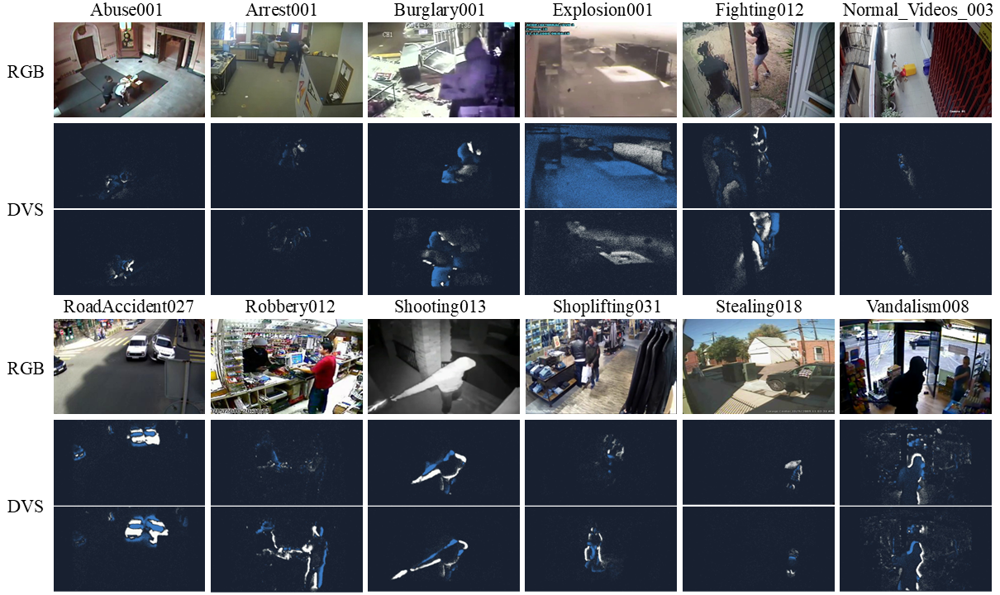
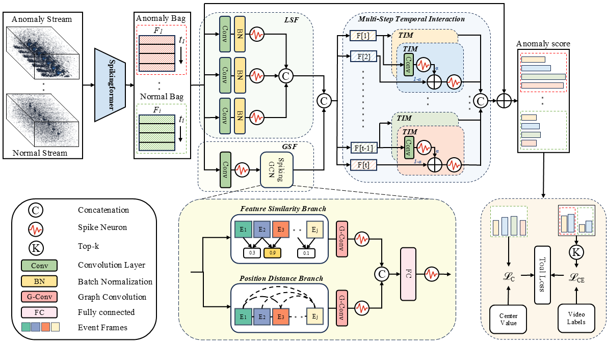

# UCF-Crime-DVS
This repository contains the official implementation of [UCF-Crime-DVS: A Novel Event-Based Dataset for Video Anomaly Detection with Spiking Neural Networks].

### :dart: Abstract
Video anomaly detection plays a significant role in intelligent surveillance systems. To enhance model's anomaly recognition ability, previous works have typically involved RGB, optical flow, and text features. Recently, dynamic vision sensors (DVS) have emerged as a promising technology, which capture visual information as discrete events with a very high dynamic range and temporal resolution. It reduces data redundancy and enhances the capture capacity of moving objects compared to conventional camera. To introduce this rich dynamic information into the surveillance field, we created the first DVS video anomaly detection benchmark, namely UCF-Crime-DVS. To fully utilize this new data modality, a multi-scale spiking fusion network (MSF) is designed based on spiking neural networks (SNNs). This work explores the potential application of dynamic information from event data in video anomaly detection. Our experiments demonstrate the effectiveness of our framework on UCF-Crime-DVS and its superior performance compared to other models, establishing a new baseline for SNN-based weakly supervised video anomaly detection.

### :fire: What's New
- [2024.12.09] Our paper is accepted by AAAI-2025 !!!
- [2024.12.12] The raw event file and pre-trained feature of UCF-Crime-DVS are all released.

### :video_camera: Dataset 
<p align="center">
  
</p>

### :dvd: Dataset Download

* **Download from Baidu Disk**: 
```
  [Pre-trained feature] 链接: https://pan.baidu.com/s/1atbxowEhdooTS9lZsKSy5g?pwd=uaba 提取码: uaba 
  [Event frame] 链接: https://pan.baidu.com/s/1BpA6z3DIuSyba2wts5M_gg?pwd=h48m 提取码: h48m 
  [Npz Event file] 链接: https://pan.baidu.com/s/1b0xSVk0tzdq19WNGSDY_og?pwd=5d8g 提取码: 5d8g 
  [Raw Event file]  链接：https://pan.baidu.com/s/10KsxHj1wQQxuanAPfBZNzQ?pwd=8v2x 提取码: 8v2x 
```
### :gem: Framework
Our proposed multi-scale spiking fusion module (MSF) captures both multi-resolution local spiking dependencies (light green block) within individual clip, and global spiking dependencies (light yellow block) between event clips. Finally, these dependencies are seamlessly integrated based on the unique characteristics of the spiking feature (light blue block).


### 💘 Acknowledgements
We thank the [SpikingJelly](https://github.com/fangwei123456/spikingjelly) library for a quickly implement.

### :newspaper: Citation 
If you find this project helpful for your research, please consider citing the following BibTeX entry.
